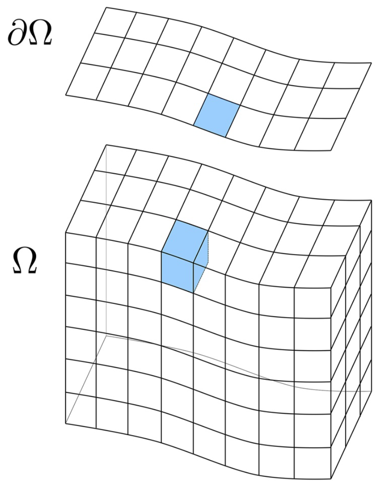

# Goals

<br>

--
- Understand the basics of .content-box-purple[`transport PK`]

--
- Build simple to advanced transport models with .content-box-yellow[`Amanzi-ATS`]

--
- .content-box-red[Visualize and analyze] ATS model outputs

---
# Setting up environment 

<br>

- Pull the `docker` `r fontawesome::fa("docker")` image

```{bash, eval=FALSE}
docker pull --platform linux/amd64 metsi/ideas-watersheds-all-hands-2024:v0
```

<br>

- Run the `docker` container to start the `JupyterLab` server

```{bash, eval=FALSE}
docker run --rm -it -p 8888:8888 metsi/ideas-watersheds-all-hands-2024:v0
```

---
class: phong-dark
# .brand-orange[Integrated hydrology model]

---
# Integrated hydrology model

**Water mass conservation equations:**

.pull-left-21[
- Surface
$$ \frac{\partial \Theta_s}{\partial t} + \nabla \cdot \vec{\mathbf{q}_s} = Q_s + Q_e$$

- Subsurface
$$ \frac{\partial \Theta_g}{\partial t} + \nabla \cdot \vec{\mathbf{q}_g} = Q_g$$

.font80[**where:**]
]
.pull-right-12[

]

.content-box-yellow[
.pull-left[.font70[
- $\Theta_s = \eta \times h$: .brand-blue[mass of water per unit surface area (mol/m^2)]
- $q_s$: .brand-blue[surface water flux (mol/m/s)]
- $\eta$: .brand-blue[molar density of liquid water (mol/m^3)]
- $h$: .brand-blue[ponded depth (m)]
]]

.pull-right[.font70[
- $\Theta_g = \eta \times S_w \times \phi$: .brand-blue[subsurface water content (mol/m^3)]
- $q_g$: .brand-blue[flux of water in the subsurface (mol/m^2/s)]
- $S_w$: .brand-blue[water saturation (m^3/m^3)]
- $\phi$: .brand-blue[medium porosity (m^3/m^3)]
]]
]

.footnote[```Molins et al. (2022)```]
---

# Domain of simulation
.pull-left-31[
<iframe width="800" height="550" src="imgs/domain.html", frameborder="0"></iframe>
]

.pull-right-13[
<br> <br>
.font60[
.content-box-purple[
.center[.brand-blue[**Entire Catchment**]]

**Dimensions:** 400 x 500 m

**\# of surface cells:** 1521

**\# of river corridor cells:** 62

**\# of soil layers:** 7

**\# of subsurface cells:** 10647

$\Delta$z = [0.1, 0.1, 0.1, 0.2, 0.2, 0.4, 0.4]

** Soil thickness:** 1.5 (m)
]]

.font60[
.content-box-yellow[
.center[.brand-red[**Square City**]]

**Dimensions:** 50 x 50 m

**\# of surface cells:** 92
]]
]

.font60[.footnote[<a href="imgs/domain.html" target="_blank">```domain of simulation```</a>]]

---

# Dependency Graph - Integrated Hydrology

.pull-left-21[
<iframe src="imgs/dependency.html" width="800" height="600" frameborder="0"></iframe>
]

--

.pull-right-12[
<br> <br>

.font70[
```xml
<ParameterList name="PK tree">
  <ParameterList name="flow coupler">
    <Parameter name="PK type" type="string" value="coupled water" />
    <ParameterList name="flow">
      <Parameter name="PK type" type="string" value="richards flow" />
    </ParameterList>
    <ParameterList name="overland flow">
      <Parameter name="PK type" type="string" value="overland flow, pressure basis" />
    </ParameterList>
  </ParameterList>
</ParameterList>
```
]]
---

# Transport
<br>

.pull-left[
**Advection-Dispersion Equation (ADE):**
$$
    \frac{\partial (\Theta C)}{\partial t} + \nabla \cdot(\mathbf{u} C) - \nabla \cdot (D \Theta \nabla C) + S = 0
$$
]

.pull-right[
.font80[
.content-box-purple[
- $C$: .brand-blue[the concentration of the solute (molC/molH2O)],
- $S$: .brand-blue[any source term],
- $D$: .brand-blue[diffusion coefficient (m^2/s)],
- $\mathbf{u}$: .brand-blue[the flow velocity field (m/s)].
]]]

--
<br>
<br>
.green[
**For transport in a subsurface domain** ($\Omega \in \mathbb{R}^3$): &nbsp; $\Theta = \eta \phi S_w$, &nbsp; $\mathbf{u}=q_g$, &nbsp; $D=D_g$.
]

--
<br>
.orange[
**For transport in a surface domain** ($\Omega \in \mathbb{R}^n$; $n=1,2$): &nbsp; $\Theta = \eta h$, &nbsp; $\mathbf{u}=q_s$, &nbsp; $D=D_s$. 
]

---

# Dependency Graph - Transport

Let's construct the **dependency graph** (or `PK tree`) for the integrated transport model.

<iframe src="imgs/dependency.html" width="1200" height="600" frameborder="0"></iframe>

